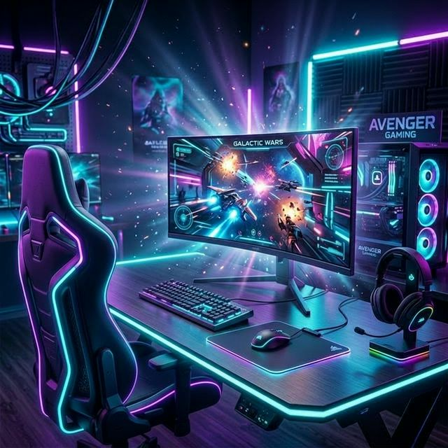

# 🎮 CABUN — Plataforma de Jogos

Uma página de login moderna e responsiva para uma plataforma de jogos, com design glassmorphism, efeito blur, partículas flutuantes e paleta de cores neon (roxo e ciano).



---

## ✨ Funcionalidades

- 🔐 **Login** com e-mail e senha
- 📝 **Criar conta** com nome de usuário, e-mail e senha
- 🔑 **Esqueceu a senha** — envia e-mail de recuperação
- 🔵 **Login com Google** (OAuth popup)
- ⚫ **Login com GitHub** (OAuth popup)
- 👁️ **Toggle de senha** — mostrar/esconder
- 🔔 **Toast notifications** — feedback visual de sucesso/erro
- 📱 **Responsivo** — funciona em desktop, tablet e mobile
- 🎨 **Glassmorphism + Blur** — design premium com efeito de vidro
- ✨ **Partículas flutuantes** — animação de fundo

---

## 🛠️ Tecnologias

| Tecnologia | Uso |
|------------|-----|
| **HTML5** | Estrutura da página |
| **CSS3** | Estilos, animações, glassmorphism, responsividade |
| **JavaScript (ES Modules)** | Lógica de autenticação e interações |
| **Firebase Auth** | Autenticação (e-mail, Google, GitHub) |
| **Firebase Firestore** | Banco de dados dos usuários |
| **Google Fonts (Outfit)** | Tipografia moderna |

---

## 📁 Estrutura de Arquivos

```
pasta certa/
├── index.html          # Página principal (HTML)
├── style.css           # Estilos visuais
├── script.js           # Lógica JavaScript + Firebase Auth
├── firebase-config.js  # Configuração do Firebase
├── bg-cabun.png        # Imagem de fundo (setup gamer)
└── README.md           # Este arquivo
```

---

## 🚀 Como Rodar

### 1. Configurar Firebase

1. Acesse [console.firebase.google.com](https://console.firebase.google.com)
2. Crie um projeto ou use o existente
3. Vá em **Authentication → Sign-in method** e ative:
   - E-mail/Senha
   - Google
   - GitHub (opcional)
4. Vá em **Firestore Database** → Criar banco de dados (modo teste)
5. Copie as credenciais do seu app web para `firebase-config.js`

### 2. Rodar Localmente

1. Abra a pasta no **VS Code**
2. Instale a extensão **Live Server**
3. Clique com botão direito em `index.html` → **"Open with Live Server"**
4. Acesse `http://127.0.0.1:5500/index.html`

> ⚠️ **Importante**: Firebase não funciona abrindo o HTML como arquivo (`file:///`). Use sempre o Live Server.

---

## 🎨 Paleta de Cores

| Cor | Hex | Uso |
|-----|-----|-----|
| 💜 Roxo | `#8b5cf6` | Cor primária, botões |
| 💎 Ciano | `#06d6e0` | Cor de destaque, links |
| 🌑 Dark | `#0a0a1a` | Fundo |
| ⬜ Light | `#f1f1f7` | Texto principal |
| 🔴 Vermelho | `#f43f5e` | Erros |
| 🟢 Verde | `#10b981` | Sucesso |

---

## 📄 Licença

Este projeto é de uso livre para fins de estudo e portfólio.

---

Feito com 💜 por **RICARDO DOURADO DA ROCHA E LUCAS RODRIGUES**
